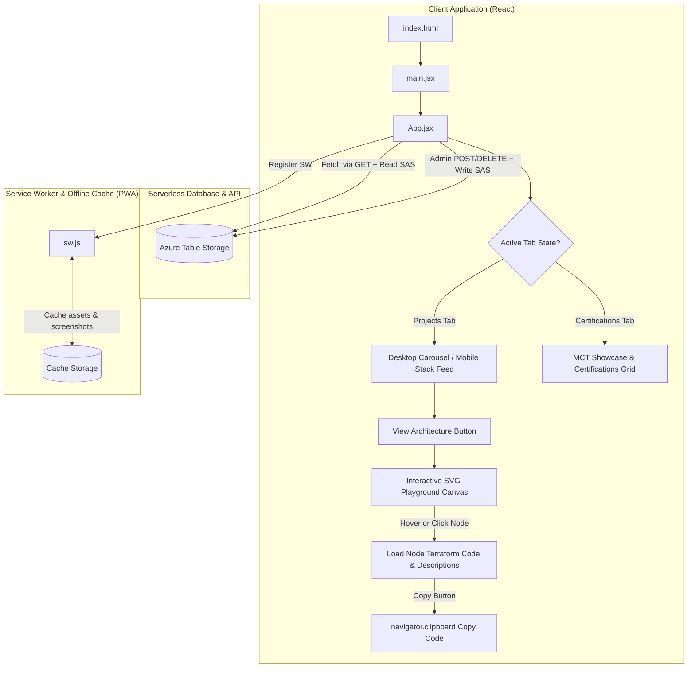
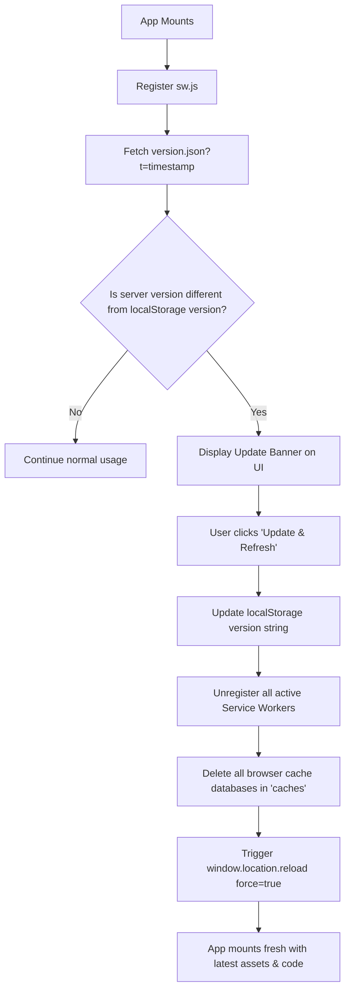

# CruzOne Projects Portal

A high-performance, responsive personal projects showcase designed with a premium glassmorphic dark-mode UI. It serves as a fully featured Progressive Web Application (PWA) that aggregates baseline GitHub project repositories, fetches dynamic projects from a serverless database, showcases verified credentials, and provides interactive cloud architecture playgrounds.

---

## ✨ Features

1. **MCT Badge & Certification Showcase**: A visually stunning verified showcase of Microsoft and AWS certifications, complete with tier-colored glassmorphic backlight glows (Expert: Purple, Associate: Blue, Fundamentals: Teal, AWS: Orange, Challenge: Green) and a golden Microsoft Certified Trainer (MCT) verification banner linked directly to MS Learn.
2. **Interactive Azure Architecture Playgrounds**: Immersive, responsive SVG resource maps for key cloud-native projects. Users can click or hover on nodes to see resource descriptions, role definitions, and copy raw HashiCorp Terraform configuration code to their clipboards.
3. **Serverless NoSQL Database Integration**: Real-time project syncing using Azure Table Storage ($0.00 cost backend) with read-only operations using SAS tokens compiled client-side, and administrative write/delete CRUD operations powered by an admin-supplied SAS key.
4. **Mobile Ergonomics**: Restructured layout stacking project cards vertically on mobile screen widths (< 992px) for normal touch-scrolling, with dedicated mobile footer docks.
5. **SEO & Social Sharing Optimization**: Seamless metadata integration with Open Graph and Twitter tags for optimized sharing views, and semantic HTML structure layout for crawlability.
6. **Dynamic PWA Updates**: Fully installable offline app checking and notifying users of version updates dynamically.

---

## 🚀 Tech Stack

### Languages & Frameworks
| Technology | Badge | Version | Description |
| :--- | :--- | :--- | :--- |
| **React** |  | `^19.2.6` | Client framework for dynamic UI and state rendering |
| **Vite** |  | `^8.0.12` | Next-generation frontend build tooling and dev server |
| **CSS3** |  | `Custom` | Vanilla layout stylesheet with responsive design systems |
| **JavaScript** |  | `ESNext` | Core script compilation |

### Backend & Cloud Services
| Service | Badge | Tier / Cost | Description |
| :--- | :--- | :--- | :--- |
| **Azure Table Storage** |  | `Serverless ($0/mo)` | Low-cost, serverless NoSQL database storing projects |
| **Azure Static Web Apps** |  | `Free Tier ($0/mo)` | Global production hosting for client distribution |
| **SAS Tokens** |  | `Built-in` | Restricts API access with read-only vs admin-write privileges |

### Frontend Utilities
| Library | Badge | Version | Description |
| :--- | :--- | :--- | :--- |
| **GSAP** |  | `^3.15.0` | Professional-grade layout scaling and slider transitions |
| **PWA** |  | `Service Worker` | Offline cache support and stand-alone home-screen app installs |
| **ESLint** |  | `^10.3.0` | Code quality and syntax validation engine |

---

## 🗺️ System Architecture

The portal dynamically switches active view tabs using GSAP fades, retrieves dynamic database objects, and renders interactive playgrounds.



---

## 🔄 PWA Update & Hard Refresh Lifecycle

The application actively checks for version mismatches between client local storage and the server definition using an automated fetch query, prompting a hard reload when updates occur.



---

## 📂 Directory Structure

```directory
.
├── eslint.config.js
├── index.html
├── package.json
├── package-lock.json
├── README.md
├── vite.config.js
├── public/
│   ├── favicon.svg          # Tab icon
│   ├── icon.png             # Official brand logo image
│   ├── icons.svg            # Vector UI icon definitions
│   ├── manifest.json        # PWA installation configurations
│   ├── sw.js                # Offline Service Worker cache implementation
│   ├── version.json         # Server version mapping for update notification
│   └── projects/            # Baseline project mockup screenshot assets
└── src/
    ├── main.jsx             # Entry point
    ├── App.jsx              # Main Application containing Carousel Slider, Grid, Node Playgrounds, and State controller
    ├── index.css            # Stylesheet containing design system, desktop animations & mobile layout overrides
    └── assets/              # Local static assets
```

---

## 👥 Author

### 👤 Francis Ponnu Cruz I
> **Azure Cloud & DevOps Engineer | Microsoft Certified Trainer (MCT)**

#### 🌐 Connect with Me:
[](https://github.com/ajf013)
[](https://www.linkedin.com/in/ajf013-francis-cruz/)
[](https://x.com/Itsme_Ajf013)
[](https://fcruz.org)
[](https://linktr.ee/AJF013)
