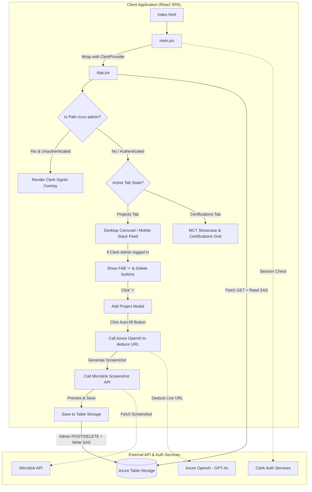
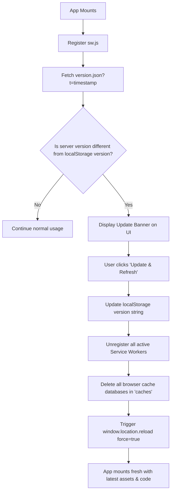

# CruzOne Projects Portal

A high-performance, responsive personal projects showcase designed with a premium glassmorphic dark-mode UI. It serves as a fully featured Progressive Web Application (PWA) that aggregates baseline GitHub project repositories, fetches dynamic projects from a serverless database, showcases verified credentials, and provides interactive cloud architecture playgrounds.

---

## ✨ Features

1. **MCT Badge & Certification Showcase**: A visually stunning verified showcase of Microsoft and AWS certifications, complete with tier-colored glassmorphic backlight glows (*Expert*: Purple, *Associate*: Blue, *Fundamentals*: Teal, *AWS*: Orange, *Challenge*: Green) and a golden Microsoft Certified Trainer (MCT) verification banner linked directly to the public [Credly Verification Page](https://www.credly.com/users/fcruz).
2. **Interactive Azure Architecture Playgrounds**: Immersive, responsive SVG resource maps for key cloud-native projects. Users can click or hover on nodes to see resource descriptions, role definitions, and copy raw HashiCorp Terraform configuration code to their clipboards.
3. **Serverless NoSQL Database Integration**: Real-time project syncing using Azure Table Storage ($0.00 cost database layer) with read-only operations using SAS tokens compiled client-side, and administrative write/delete CRUD operations.
4. **Clerk Admin Authentication**: Premium authentication via Clerk utilizing GitHub social sign-in. The admin interface is restricted to a hidden, custom path (`/cruz-admin`) and hidden entirely from public users, granting access only if the logged-in user email matches the configured admin identity (`VITE_ADMIN_EMAIL`).
5. **AI-Powered Auto-Fill & Screenshot Generator**: An AI-driven service integrated directly into the project creation form. It uses Azure OpenAI (GPT-4o version `2024-11-20`) to analyze project details (title, category, description, and repo) and automatically deduce the live URL. It then uses the Microlink API to take a real-time screenshot of the live site and render it as the card's background.
6. **Mobile Ergonomics**: Restructured layout stacking project cards vertically on mobile screen widths (< 992px) for normal touch-scrolling, with dedicated mobile footer docks.
7. **Dynamic PWA Updates**: Fully installable offline app checking and notifying users of version updates dynamically.

---

## 🚀 Tech Stack

### Languages & Frameworks
| Technology | Badge | Version | Description |
| :--- | :--- | :--- | :--- |
| **React** |  | `^19.2.6` | Client framework for dynamic UI and state rendering |
| **Vite** |  | `^8.0.12` | Next-generation frontend build tooling and dev server |
| **CSS3** |  | `Custom` | Vanilla layout stylesheet with responsive design systems |
| **JavaScript** |  | `ESNext` | Core script compilation |

### Backend, Cloud & AI Services
| Service | Badge | Tier / Cost | Description |
| :--- | :--- | :--- | :--- |
| **Azure Table Storage** |  | `Serverless ($0/mo)` | Low-cost, serverless NoSQL database storing portfolio projects |
| **Azure Static Web Apps** |  | `Free Tier ($0/mo)` | Global production hosting for client distribution |
| **Azure OpenAI Service** |  | `Serverless` | Model (GPT-4o deployment) used to deduce live website URLs based on project metadata |
| **Clerk Auth** |  | `Free Tier` | Secure user authentication and access controls |
| **Microlink API** |  | `Free` | Headless browser service converting live URLs into homepage screenshots |

### Frontend Utilities & Libraries
| Library | Badge | Version | Description |
| :--- | :--- | :--- | :--- |
| **GSAP** |  | `^3.15.0` | Professional-grade layout scaling and slider transitions |
| **PWA** |  | `Service Worker` | Offline cache support and stand-alone home-screen app installs |
| **ESLint** |  | `^10.3.0` | Code quality and syntax validation engine |

---

## 🗺️ System Architecture

The portal dynamically switches active view tabs using GSAP fades, retrieves dynamic database objects, and renders interactive playgrounds.



---

## 🔄 App Flow & Authentication Logic

### 1. Public Visitor Flow
- Visitors land on the root path `/`.
- The application fetches existing projects from Azure Table Storage using the read-only SAS token (`VITE_READ_SAS`).
- Public users browse projects via the desktop carousel or vertical mobile grid and view Microsoft/AWS credentials.
- All administrative controls (add button, delete options, and logout button) are hidden from standard visitors.
- If no Clerk publishable key is present, the app falls back to a dummy key to prevent frontend crashes, maintaining a seamless public experience.

### 2. Secret Admin Access Flow (`/cruz-admin`)
- The administrator navigates directly to `/cruz-admin`.
- The application reads the URL path and intercepts rendering. If the administrator is unauthenticated, Clerk's `<SignIn />` prompt is shown (using GitHub OAuth).
- Once signed in, the client validates the authenticated user's email address against the whitelisted `VITE_ADMIN_EMAIL` (default fallback: `anto13franc@outlook.com`).
  - **Authorized**: Sets `isAdmin = true` and updates state, granting administrative options. The admin button changes to "Exit Admin".
  - **Unauthorized**: Renders an "Access Denied" overlay showing the unauthorized email address with an option to sign out or switch accounts.

### 3. AI-Assisted Project Generation Flow
- When the Administrator clicks the Floating Action Button (`+`), the project modal opens.
- The Administrator inputs the *Title*, *Category*, *Description*, and *GitHub Repo* and clicks the **AI Auto-fill** button.
- The application calls the Azure OpenAI Service (`gpt-4o` model deployment) via the client service module (`aiService.js`).
- The AI analyzes the details, deduces the correct subdomain configuration on `fcruz.org` (e.g., `https://atsscore.fcruz.org` or `https://sticky-notes.fcruz.org`), and responds.
- The deduced live URL is populated in the form, and a screenshot preview fetch request is triggered via the Microlink screenshot API.
- Upon saving, the project data is pushed to Azure Table Storage via the administrative write SAS token (`VITE_WRITE_SAS`).

---

## ⚙️ Configuration & Environment Setup

Create a `.env` file in the root of the project using the structure from `.env.example`:

| Environment Variable | Required | Description |
| :--- | :--- | :--- |
| `VITE_AZURE_TABLE_URL` | Yes | Endpoint to your Azure Table Storage table (e.g., `https://<account>.table.core.windows.net/projects`) |
| `VITE_READ_SAS` | Yes | Azure Table SAS token containing Read permission (`r`) |
| `VITE_WRITE_SAS` | Yes (Admin) | Azure Table SAS token containing Read, Add, Update, Delete permissions (`raud`) |
| `VITE_AZURE_OPENAI_KEY` | Yes (AI) | The API key for your Azure OpenAI instance |
| `VITE_AZURE_OPENAI_ENDPOINT` | Yes (AI) | The URL endpoint of your Azure OpenAI resource |
| `VITE_AZURE_OPENAI_DEPLOYMENT` | Yes (AI) | The deployment name of your `gpt-4o` model |
| `VITE_AZURE_OPENAI_API_VERSION` | Yes (AI) | The API version to call (e.g. `2024-02-15-preview` or similar) |
| `VITE_CLERK_PUBLISHABLE_KEY` | Yes | The publishable key from your Clerk dashboard (both development and production keys supported) |
| `VITE_ADMIN_EMAIL` | Yes | The authorized email address that will be granted admin privileges (e.g., `jeni13franc@gmail.com`) |

---

## 📂 Project Tree Structure

```directory
.
├── .env                        # Local configuration file (ignored by Git)
├── .env.example                # Template configuration file for development
├── .gitignore                  # Git untracked pattern definitions
├── eslint.config.js            # Lint config rules
├── index.html                  # Core HTML structure template
├── netlify.toml                # Netlify SPA redirect configurations
├── package.json                # Project dependencies and script declarations
├── package-lock.json           # Locked dependencies mapping
├── README.md                   # Project documentation (this file)
├── vite.config.js              # Vite compiler configuration
├── public/
│   ├── _redirects              # Netlify fallback routing rule for client-side SPAs
│   ├── favicon.svg             # Application tab browser icon
│   ├── icon.png                # Brand identity logo
│   ├── icons.svg               # Inline SVG sprite icons
│   ├── manifest.json           # Progressive Web Application config
│   ├── staticwebapp.config.json# Azure Static Web Apps SPA fallback configuration
│   ├── sw.js                   # Service Worker offline assets cacher
│   ├── version.json            # Deployment tracker for dynamic PWA hot reloading
│   └── projects/               # Baseline project mockup screenshot assets
│       ├── ats_analyzer.png
│       ├── cloudsentry.png
│       ├── converter_app.png
│       ├── cruzops_ai.png
│       ├── financial_insights.png
│       ├── francis_portfolio.png
│       ├── music_player.png
│       ├── sticky_notes.png
│       └── unicompile.png
└── src/
    ├── main.jsx                # SPA Entry point (wrapped inside ClerkProvider)
    ├── App.jsx                 # Core routing, GSAP layout engine, state controls & admin panels
    ├── index.css               # Vanilla stylesheet containing custom responsive design systems & overrides
    ├── assets/                 # Embedded React/Vite assets
    │   ├── hero.png
    │   ├── react.svg
    │   └── vite.svg
    └── services/
        └── aiService.js        # Azure OpenAI + Microlink screenshot generator orchestration
```

---

## 🔄 PWA Update & Hard Refresh Lifecycle

The application checks for version mismatches between client local storage and the server definition using an automated fetch query, prompting a hard reload when updates occur.



---

## 🛠️ Local Development

### Prerequisites
- Node.js installed (v18+ recommended)
- Azure Table Storage setup and keys
- Clerk Project configured with GitHub OAuth

### Setup Instructions
1. Clone the repository and install dependencies:
   ```bash
   npm install
   ```
2. Set up the local `.env` configuration file using `.env.example`.
3. Start the local development server:
   ```bash
   npm run dev
   ```
4. Build the application for production:
   ```bash
   npm run build
   ```
5. Locally preview the production build output:
   ```bash
   npm run preview
   ```

---

## 👥 Author

### 👤 Francis Ponnu Cruz I
> **Azure Cloud & DevOps Engineer | Microsoft Certified Trainer (MCT)**

#### 🌐 Connect with Me:
[](https://github.com/ajf013)
[](https://www.linkedin.com/in/ajf013-francis-cruz/)
[](https://x.com/Itsme_Ajf013)
[](https://fcruz.org)
[](https://linktr.ee/AJF013)
