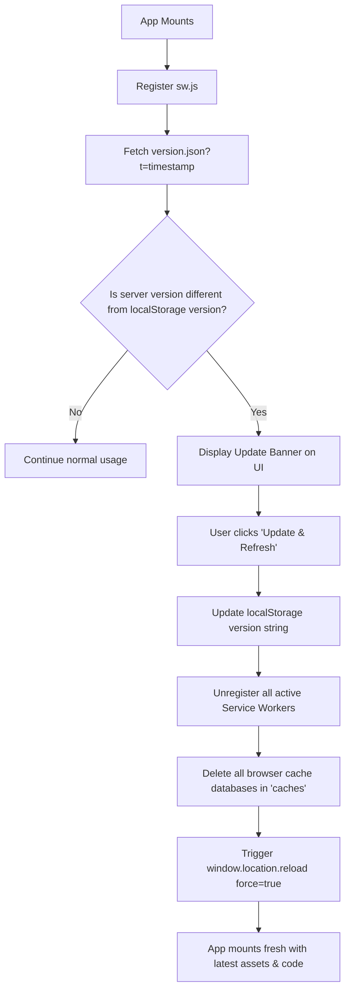

# CruzOne Projects Portal

A high-performance, responsive personal projects showcase designed with a premium glassmorphic dark-mode UI. It serves as a fully featured Progressive Web Application (PWA) that aggregates baseline GitHub project repositories and permits adding and managing projects dynamically.

---

## 🚀 Tech Stack

### Languages & Frameworks
| Technology | Badge | Version | Description |
| :--- | :--- | :--- | :--- |
| **React** |  | `^19.2.6` | Client framework for dynamic UI and state rendering |
| **Vite** |  | `^8.0.12` | Next-generation frontend build tooling and dev server |
| **CSS3** |  | `Custom` | Vanilla layout stylesheet with responsive design systems |
| **JavaScript** |  | `ESNext` | Core script compilation |

### Libraries & Infrastructure
| Library/Service | Badge | Version | Description |
| :--- | :--- | :--- | :--- |
| **GSAP** |  | `^3.15.0` | Professional-grade layout scaling and slider transitions |
| **PWA** |  | `Service Worker` | Offline cache support and stand-alone home-screen app installs |
| **ESLint** |  | `^10.3.0` | Code quality and syntax validation engine |

---

## 🗺️ System Architecture

The portal dynamically switches between a GSAP-powered horizontal carousel slider on desktop viewports and a stacked card feed on mobile screen sizes.

```mermaid
graph TD
    subgraph Client Application (React & GSAP)
        A[index.html] --> B[main.jsx]
        B --> C[App.jsx]
        C --> D{Viewport Width?}
        
        %% Layout Rendering
        D -- ">= 992px (Desktop)" --> E[GSAP Horizontal Carousel Slider]
        D -- "< 992px (Mobile)" --> F[Stacked Flex Column Project Feed]
        
        %% State Management
        C --> G[(LocalStorage Projects)]
        C --> H[(Theme State)]
    end

    subgraph Service Worker & Offline Cache (PWA)
        I[sw.js] <--> |Caches Assets & screenshots| J[(Cache Storage)]
        C --> |Register SW| I
    end
```

---

## 🔄 PWA Update & Hard Refresh Lifecycle

The application actively checks for version mismatches between client local storage and the server definition using an automated fetch query, prompting a hard reload when updates occur.



---

## 📂 Directory Structure

```directory
.
├── eslint.config.js
├── index.html
├── package.json
├── package-lock.json
├── README.md
├── vite.config.js
├── public/
│   ├── favicon.svg          # Tab icon
│   ├── icon.png             # Official brand logo image
│   ├── icons.svg            # Vector UI icon definitions
│   ├── manifest.json        # PWA installation configurations
│   ├── sw.js                # Offline Service Worker cache implementation
│   ├── version.json         # Server version mapping for update notification
│   └── projects/            # Baseline project mockup screenshot assets
└── src/
    ├── main.jsx             # Entry point
    ├── App.jsx              # Main Application containing Carousel Slider, Grid, and State controller
    ├── index.css            # Stylesheet containing design system, desktop animations & mobile layout overrides
    └── assets/              # Local static assets
```

---

## 👥 Author

### 👤 Francis Ponnu Cruz I
> **Azure Cloud & DevOps Engineer | Microsoft Certified Trainer (MCT)**

#### 🌐 Connect with Me:
[](https://github.com/ajf013)
[](https://www.linkedin.com/in/ajf013-francis-cruz/)
[](https://x.com/Itsme_Ajf013)
[](https://fcruz.org)
[](https://linktr.ee/AJF013)
